## Keycloak Configuration Steps (Step-by-Step)

1. **Create Client**
   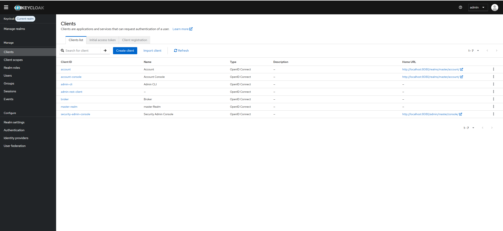

2. **Add Client Name**
   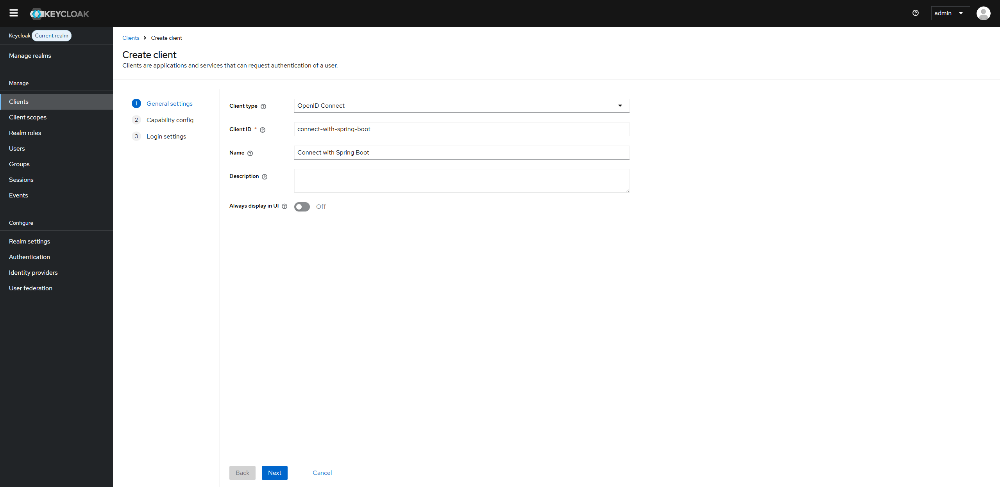

3. **Choose Authentication Flow**
   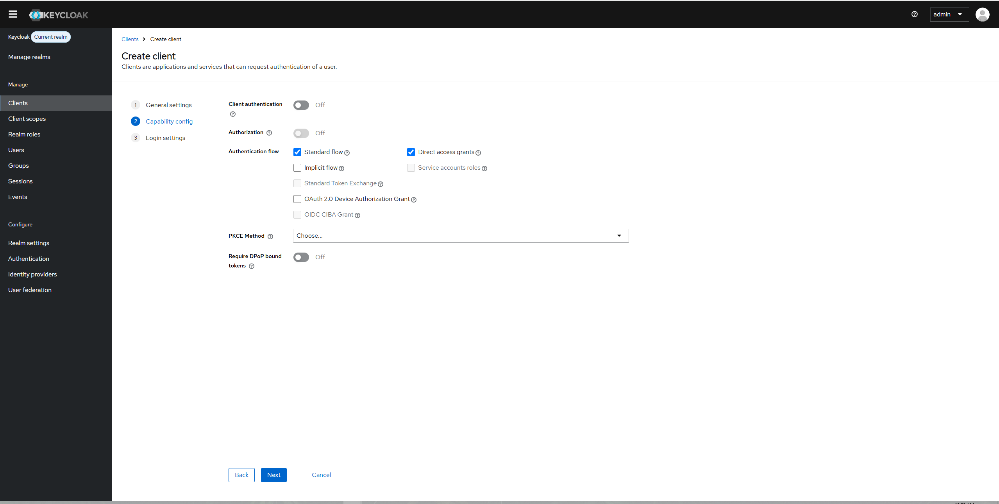

4. **Login Setting Step**
   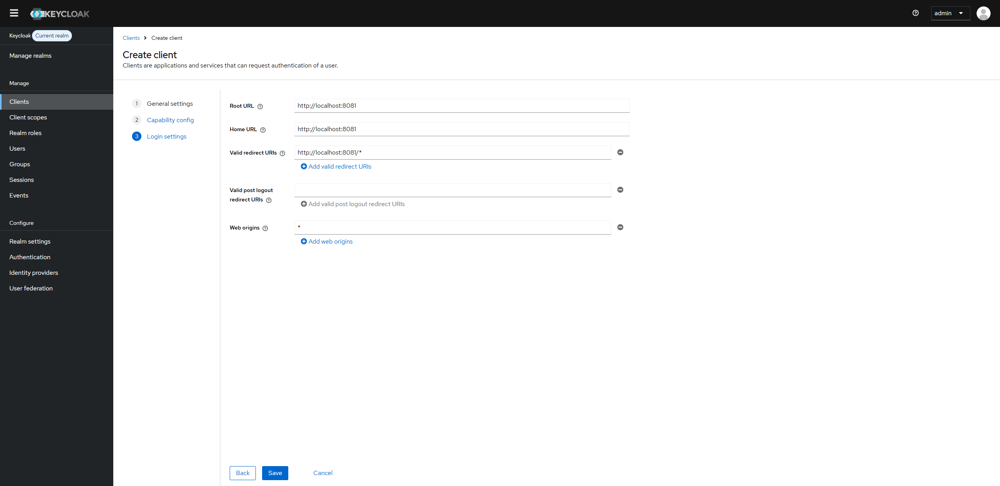

5. **Verify Create Client Step**
   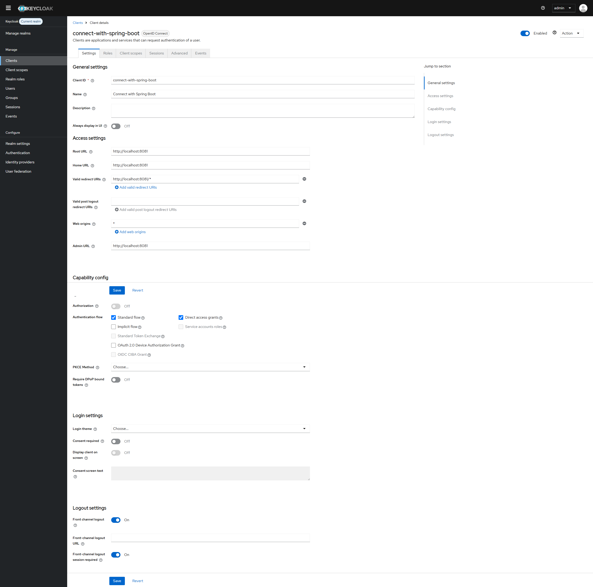

6. **See Your Client Created in List**
   

7. **Admin Create Realm Roles**
   

8. **Click Create Realm Roles**
   

9. **Create User Realm Role**
   

10. **Step Create User**
    

11. **After Create User**
    

12. **Set Password For User**
    

13. **Click Set Password For User**
    

14. **Click Save Password**
    

15. **See Password In List**
    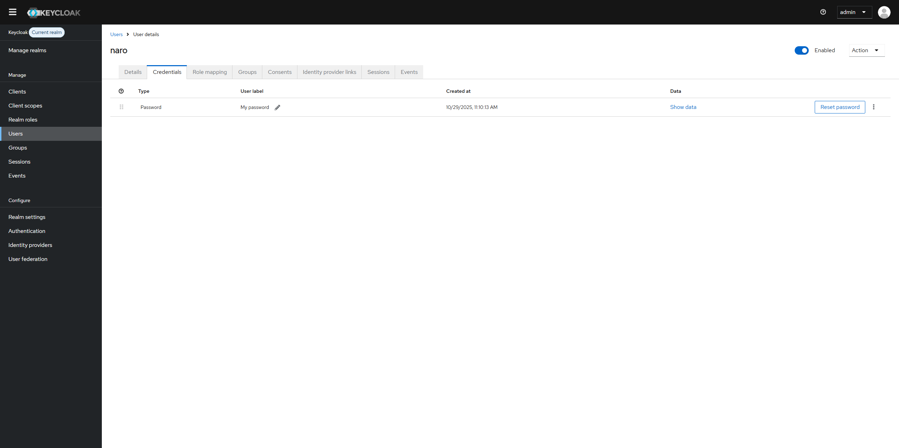

16. **Create Role For Client**
    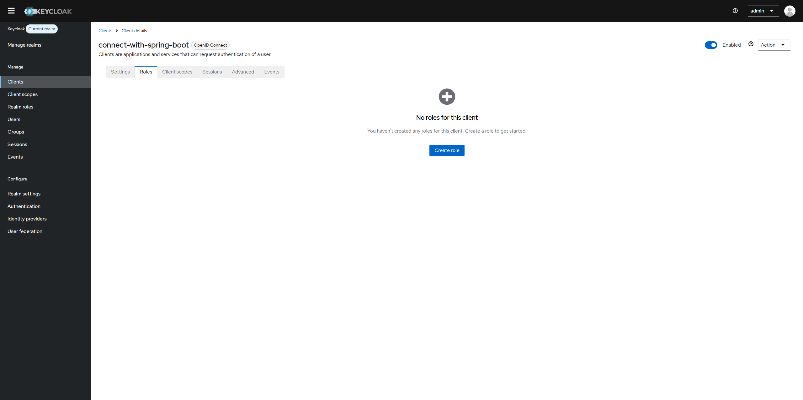

17. **Click Client For Create Role**
    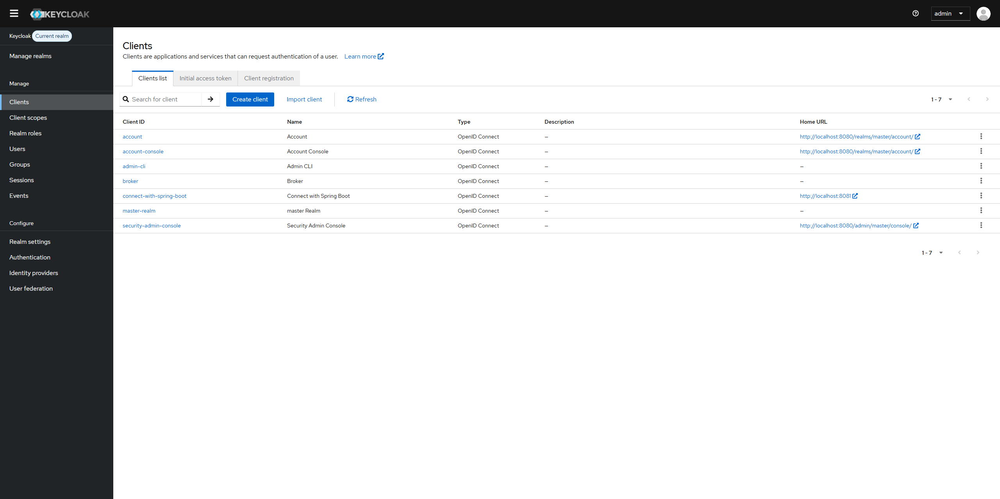

18. **Create Client Admin**
    

19. **Create Client User**
    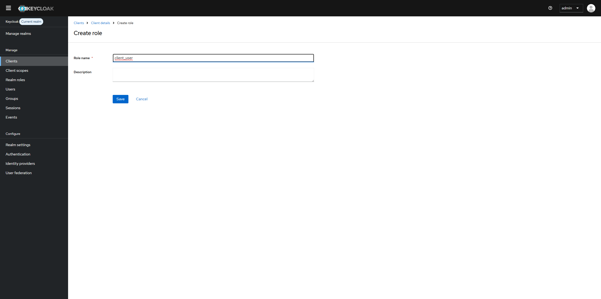

20. **After Create Client We Have Two Clients In List**
    

21. **Go To Realm Roles**
    

22. **Assign Client Role**
    

23. **Assign Client For User Role Admin**
    

24. **Click For User Role For Assign Client**
    

25. **Click Assign Client Role For Assign To User**
    

26. **Search Client For Role User And Click Assign**
    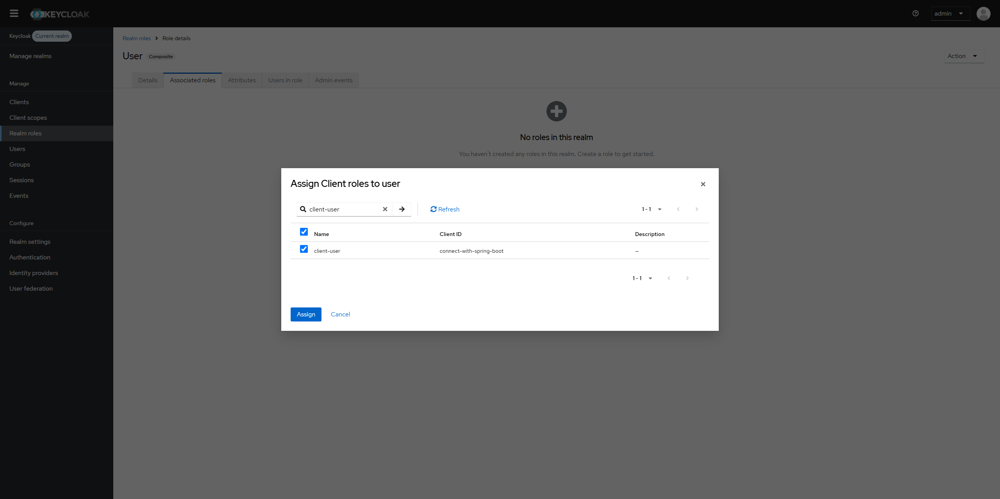

27. **Client User Role Assigned**
    

28. **User Role In List Column Composite Is Changed To True**
    

29. **Go To User List**
    

30. **Click On Assign Client Role**
    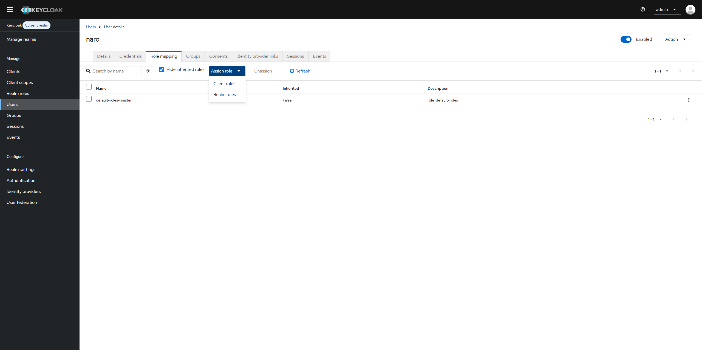

31. **Search Client Admin And Assign**
    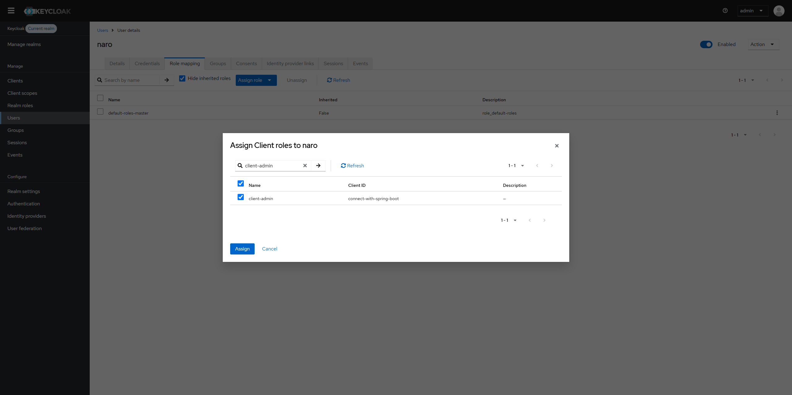

32. **Role Is Assigned**
    

33. **Click To See Endpoint Configuration**
    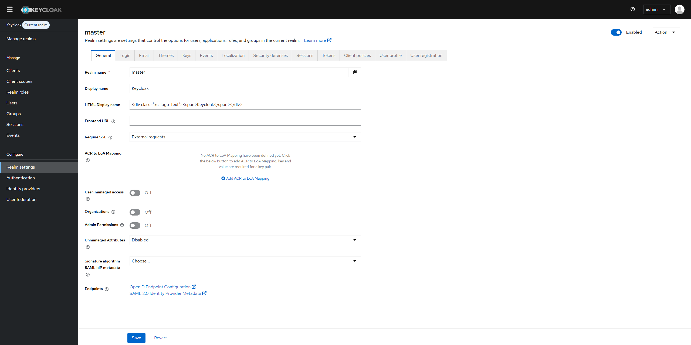

34. **You Will See All Endpoint Of Configuration**
    

35. **Login With Postman**
    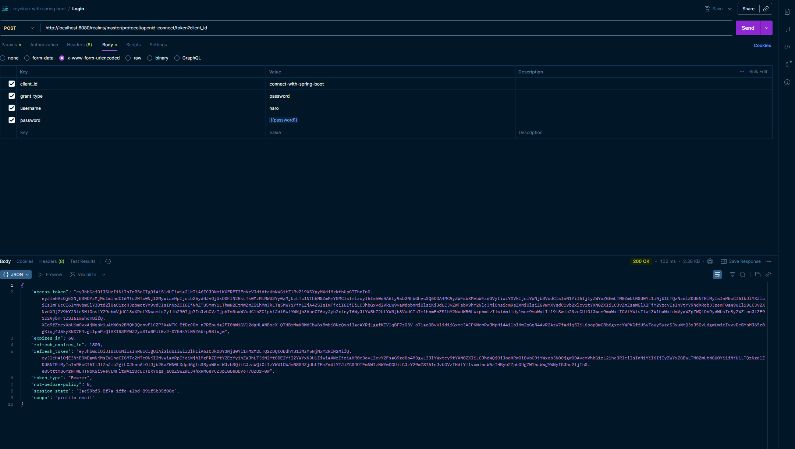

36. **Check Access Token**
    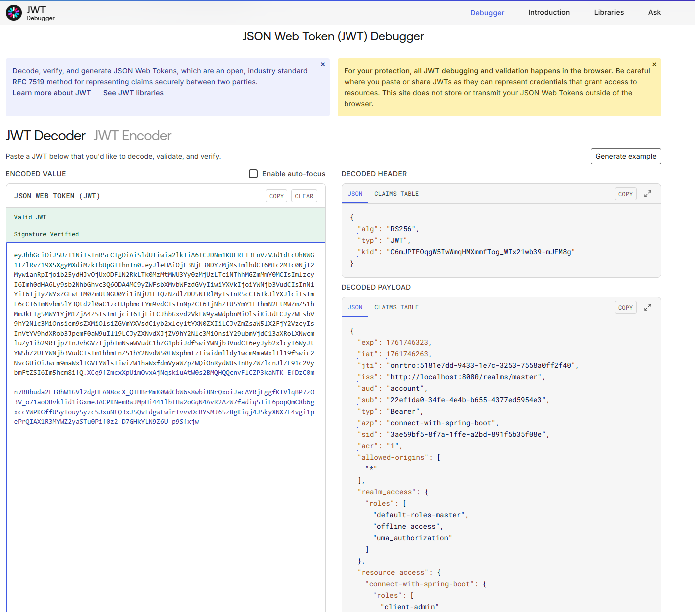

37. **Create Project Spring Boot**
    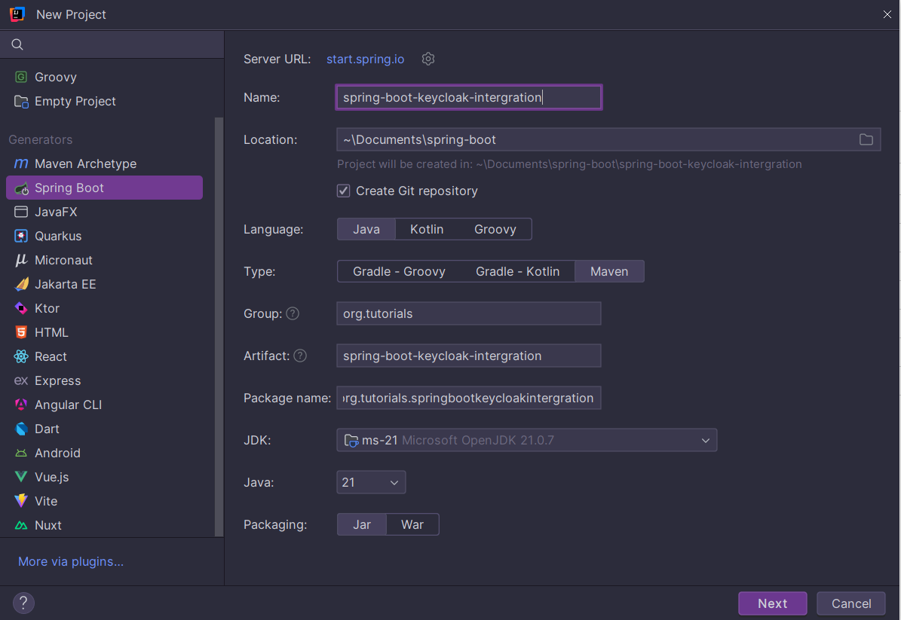

38. **Add Dependency Server**
    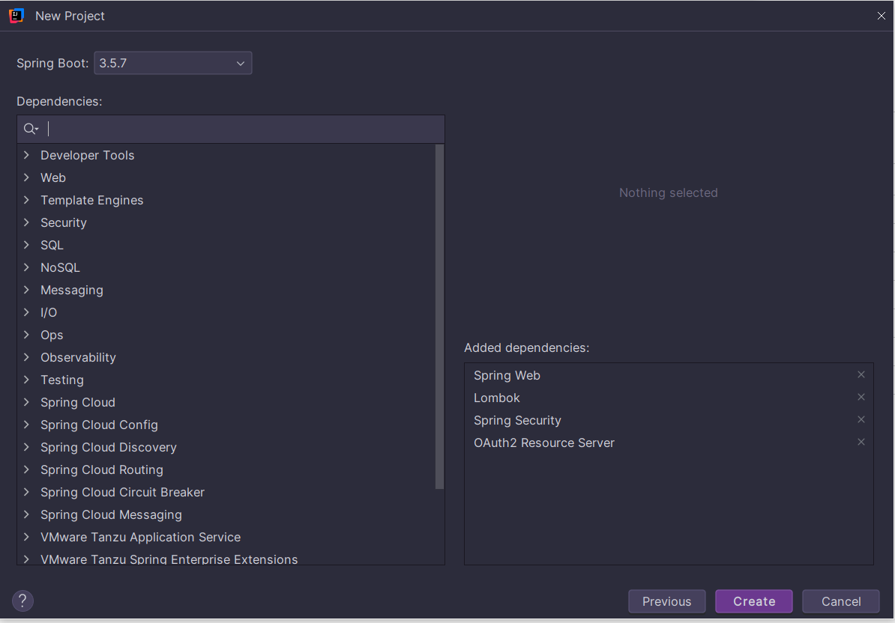

# Spring Boot & Keycloak Integration Example

This project is a demonstration of how to secure a Spring Boot REST API using Keycloak as an OAuth2/OIDC Identity and Access Management provider. The application is configured as a Resource Server that validates JSON Web Tokens (JWTs) issued by a Keycloak instance.

## Features

-   **OAuth2 Resource Server**: The application acts as a resource server, protecting its endpoints.
-   **JWT Validation**: It validates JWTs issued by Keycloak, checking the signature and issuer.
-   **Role-Based Access Control (RBAC)**: Endpoints are secured based on user roles defined in Keycloak.
-   **Custom Role Mapping**: A `JwtAuthConverter` is implemented to correctly map Keycloak's realm roles to Spring Security's `GrantedAuthority` objects.

## Technology Stack

-   Java 21
-   Spring Boot 3.x
-   Spring Security 6.x (OAuth2 Resource Server)
-   Maven
-   Keycloak

---

## Prerequisites

Before you begin, ensure you have the following installed:
-   JDK 21 or later
-   Maven 3.8 or later
-   A running Keycloak instance (you can use Docker for a quick setup).

---

## 1. Keycloak Configuration

You need to configure a realm, a client, roles, and users in your Keycloak instance.

### 1.1. Create a Realm
Create a new realm (e.g., `my-realm`).

### 1.2. Create Roles
In your new realm, create at least two roles:
-   `user`
-   `admin`

### 1.3. Create a Client
1.  Go to **Clients** and create a new client.
2.  Set the **Client ID** (e.g., `spring-boot-client`).
3.  Ensure **Client authentication** is **On**.
4.  On the **Capability config** tab, enable **Direct access grants**. This allows you to get a token using a username and password, which is useful for testing.
5.  Save the client.
6.  Go to the **Credentials** tab and copy the **Client secret**. You will need this for testing.

### 1.4. Create Users
1.  Go to **Users** and create two users.
2.  **User One**:
    -   Set a username (e.g., `testuser`).
    -   Go to the **Credentials** tab and set a password.
    -   Go to the **Role mapping** tab, click **Assign role**, and assign the `user` role.
3.  **User Two**:
    -   Set a username (e.g., `testadmin`).
    -   Go to the **Credentials** tab and set a password.
    -   Go to the **Role mapping** tab, click **Assign role**, and assign both `admin` and `user` roles.

---

## 2. Project Setup

### 2.1. Configure Application Properties
Update the `src/main/resources/application.properties` file with your Keycloak realm details.

```properties
# File: src/main/resources/application.properties

# Application name
spring.application.name=spring-boot-keycloak-integration

# Server port
server.port=8081

# ===============================================
# OAUTH2 (KEYCLOAK) RESOURCE SERVER CONFIGURATION
# ===============================================

# The URI of the Keycloak realm.
# Spring Security uses this to discover the authorization server's public keys
# to validate the JWT signature.
# Replace 'my-realm' with the name of your Keycloak realm.
spring.security.oauth2.resourceserver.jwt.issuer-uri=http://localhost:8080/realms/my-realm
```

### 2.2. Build and Run the Application
You can run the application using the Maven wrapper.

Open a terminal in the project root directory and run:

```bash
./mvnw spring-boot:run
```

The application will start on `http://localhost:8081`.

---

## 3. Testing the API

You will need an access token from Keycloak to call the secured endpoints.

### 3.1. Get an Access Token
Use `curl` to request an access token from Keycloak. Replace the placeholders with your own values.

```bash
curl -X POST "http://localhost:8080/realms/my-realm/protocol/openid-connect/token" \
-H "Content-Type: application/x-www-form-urlencoded" \
-d "grant_type=password" \
-d "client_id=spring-boot-client" \
-d "client_secret=your-client-secret" \
-d "username=testuser" \
-d "password=the-user-password"
```

The response will contain an `access_token`. Copy it for the next step.

### 3.2. Call the Secured Endpoints

Use the obtained `access_token` to make requests to the API.

#### Endpoint for Users (`/api/v1/demo/user`)
This endpoint requires the `user` role.

```bash
curl -X GET http://localhost:8081/api/v1/demo/user \
-H "Authorization: Bearer <YOUR_ACCESS_TOKEN>"
```
**Expected Response:**
```
Hello from Spring Boot & Keycloak - USER
```

#### Endpoint for Admins or Users (`/api/v1/demo/admin-or-user`)
This endpoint requires either the `admin` or `user` role.

```bash
curl -X GET http://localhost:8081/api/v1/demo/admin-or-user \
-H "Authorization: Bearer <YOUR_ACCESS_TOKEN>"
```
**Expected Response:**
```
Hello from Spring Boot & Keycloak - ADMIN or USER

```
# Spring Boot & Keycloak Integration — Step Images and Config

This document shows the Keycloak configuration steps (mapped to your screenshot filenames). Put the images in your project at:

Of course. The reason the images may not be displaying is likely due to the file paths and potential typos in the filenames within your `README.md`. Markdown image links are sensitive to both.

I will correct the typos in the filenames and adjust the image paths to be more standard for a `README.md` file at the project root. A common practice is to place documentation images in a dedicated folder at the root of the project, like `.github/images/`.

Here are the steps:

1.  I'll provide the command to create a new directory for the images.
2.  I'll update the `README.md` file with the corrected paths and filenames.

### 1. Create Image Directory

First, create a directory to store the images for your `README.md`. Open your terminal and run this command from the root of your project:

```bash
mkdir -p .github/images
```

Now, please **move all your PNG image files** into this new `.github/images/` directory and rename them to match the corrected filenames I will use in the `README.md` below.

### 2. Update `README.md`

Here are the changes for your `README.md` file. I've corrected the typos and updated the image paths.


// File: C:\Users\SOVANNARO\Documents\spring-boot\spring-boot-keycloak-intergration\README.md
// ... existing code
Hello from Spring Boot & Keycloak - ADMIN or USER